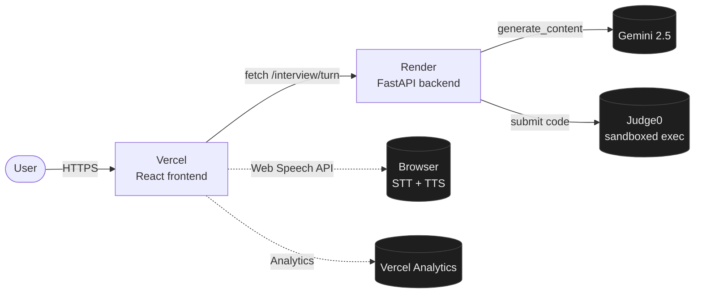

# mock-with-ai

An AI-powered mock technical interview platform. You pick a coding problem, talk through your approach with an AI interviewer (text *or* voice), write code in a real editor, run it against test cases, and get a structured scorecard at the end.

**Live demo:** <https://mock-tech-with-ai.vercel.app>

<!-- Replace this placeholder with your hero screenshot. See docs/screenshots/SCREENSHOTS.md -->


---

## Why this exists

LeetCode tests whether you can solve problems silently. Real interviews test whether you can solve problems while explaining your thinking, taking feedback, and backing up your decisions out loud. mock-with-ai is the second part — a no-stakes way to practice the conversation, not just the code.

The AI interviewer behaves like a mid-level engineer named Alex. It pushes back on shaky reasoning, asks for time/space complexity before letting you code, nudges you with questions instead of giving you the answer, and at the end produces a scorecard across four axes — correctness, code quality, communication, problem-solving — with concrete strengths and weaknesses.

## What makes it different

- **Voice mode.** Click a mic and talk through your approach the way you would in a real interview. The AI hears you, thinks, and speaks back. No setup, no API keys for the user, fully browser-native.
- **Editor-aware AI.** The interviewer sees your code as you write it. It comments on what you've written (`"I see you started a loop over nums…"`) but never recites it back at you or hands you the algorithm.
- **Real code execution.** Your code runs in a Judge0 sandbox against hidden test cases — actual `passed: 7/10`, not vibes.
- **Structured evaluation.** Submit triggers a scorecard, not a thumbs-up. Four numeric scores 1–5, a verdict (`Strong / Solid / Needs work / Not ready`), plus written strengths and weaknesses.
- **Problem-agnostic prompt.** The system prompt knows nothing about specific problems. The current problem is injected as a context turn, so the same interviewer persona works across the whole problem bank.

## Screenshots

<!-- Drop each image into docs/screenshots/ with the filenames below. -->

| | |
|:--:|:--:|
|  |  |
| Landing page | Text interview mode |
|  |  |
| Voice interview mode | Scorecard after submit |

## Tech stack

| Layer | Choice | Why |
|---|---|---|
| Frontend | React 19 + TypeScript + Vite | Fast dev loop, strict types, modern toolchain |
| Editor | Monaco | Same engine as VS Code, zero-config syntax highlighting |
| Backend | FastAPI (Python 3.11) | Pydantic schemas, async, OpenAPI for free |
| LLM | Gemini 2.5 Flash | Generous free tier, low latency, structured output for the scorecard |
| Code exec | Judge0 (RapidAPI) | Sandboxed multi-language execution, no infra to run |
| Voice STT | Web Speech API | Browser-native, free, ~1s latency |
| Voice TTS | `window.speechSynthesis` | Browser-native, free, OS-provided voices |
| Hosting | Vercel (frontend) + Render (backend) | Free tier, GitHub auto-deploy |
| Domain | is-a.dev (free) | `mock-with-ai.is-a.dev` |

## Architecture



The backend has four routers: `/interview/turn` (chat), `/execution/run` and `/execution/submit` (code), `/problems` (problem bank), `/health`. The system prompt enforces voice-ready output (1–3 sentences, no markdown, no stage directions) so the same model output works for both text and TTS playback.

See [`docs/ARCHITECTURE.md`](docs/ARCHITECTURE.md) for the full breakdown.

## Quick start (local)

You need Python 3.11+, Node 20+, a Gemini API key, and a Judge0 RapidAPI key.

```bash
# Clone
git clone https://github.com/bekiTil/ai-mock-interview.git
cd ai-mock-interview

# Backend
cd backend
python -m venv .venv
source .venv/bin/activate
pip install -r requirements.txt
cp .env.example .env
# edit .env with your GEMINI_API_KEY and JUDGE0_API_KEY
uvicorn main:app --reload --port 8000

# Frontend (in a new terminal)
cd frontend
npm install
npm run dev
```

Open <http://localhost:5173>. The frontend defaults to `http://localhost:8000` for the API — no `.env.local` needed for local dev.

## Project structure

```
ai-mock-interview/
├── backend/
│   ├── main.py                  # FastAPI entrypoint
│   ├── app/
│   │   ├── config.py            # env-driven settings
│   │   ├── routers/             # /interview, /execution, /problems, /health
│   │   ├── services/            # Gemini client, Judge0 client, evaluator, prompts
│   │   └── schemas/             # Pydantic request/response models
│   ├── problems/                # JSON problem bank
│   ├── Dockerfile               # used by Render
│   └── requirements.txt
├── frontend/
│   ├── src/
│   │   ├── pages/               # Landing, InterviewApp
│   │   ├── components/          # ChatPanel, VoicePanel, CodeEditor, OutputPanel, …
│   │   ├── hooks/               # useSpeechRecognition, useSpeechSynthesis
│   │   ├── api/                 # typed fetch wrappers
│   │   ├── types/               # shared types
│   │   └── styles/              # design tokens
│   ├── vercel.json
│   └── package.json
├── render.yaml                  # blueprint for Render deploy
└── docs/
    ├── ARCHITECTURE.md
    ├── DEMO_SCRIPT.md
    └── screenshots/
```

## Deployment

- **Frontend** auto-deploys to Vercel on push to `main`. Set `VITE_API_BASE_URL` in Vercel's env vars.
- **Backend** auto-deploys to Render on push to `main` via `render.yaml`. Set `GEMINI_API_KEY` and `JUDGE0_API_KEY` in Render's env vars.
- **Domain**: `mock-with-ai.is-a.dev` is registered via the [is-a.dev](https://www.is-a.dev) program, CNAMEd to Vercel.
- **Cold-start mitigation**: `.github/workflows/keepalive.yml` pings the backend every 12 min to keep Render's free tier warm.

## Roadmap

**Done**
- [x] v1.0 — text chat interview with code execution + scorecard
- [x] v2.0 — voice mode (browser-native STT + TTS, free)
- [x] Public deploy on Vercel + Render + is-a.dev
- [x] Vercel Analytics + keep-alive cron

**Up next**
- [ ] 5–10 more problems beyond the seed set
- [ ] Difficulty + category filters in the problem picker
- [ ] Polished error states for Gemini timeouts and Judge0 failures
- [ ] Mobile QA pass
- [ ] Session history (persist past interviews + scorecards)

**Future**
- [ ] Neural TTS upgrade (OpenAI / ElevenLabs) for more natural voice
- [ ] Hands-free voice mode with VAD
- [ ] Behavioral interview mode
- [ ] Multi-language support (JavaScript, Java)

## Built by

[Bereket Tilahun](https://github.com/bekiTil) — solo build, 15 days end-to-end.

If you have feedback or want to talk technical interviews / AI tooling, open an issue or DM.

## License

MIT
