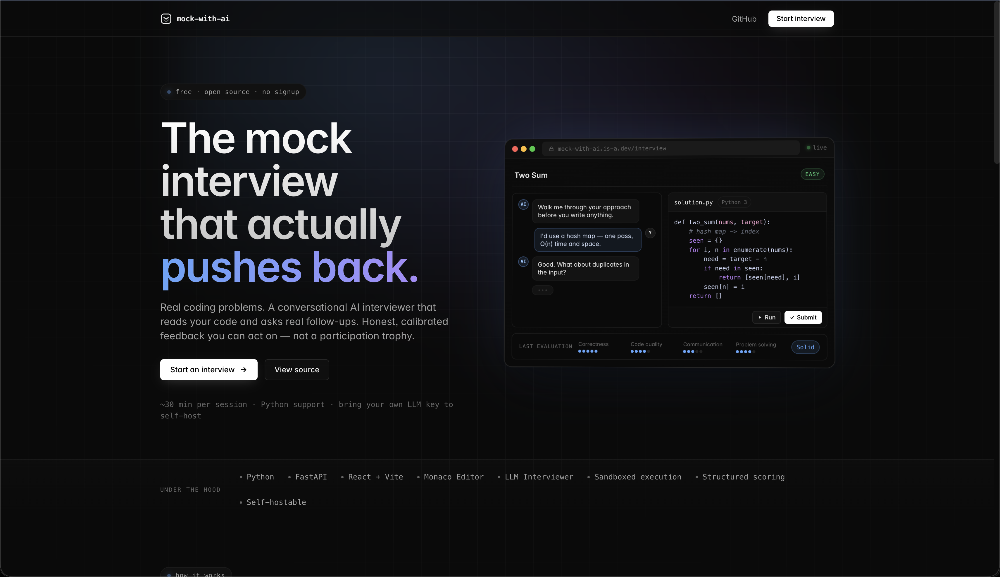
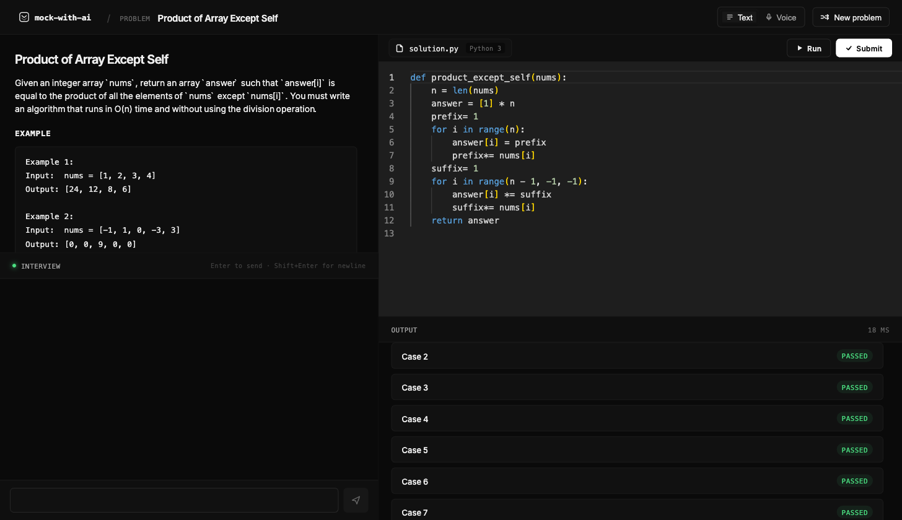
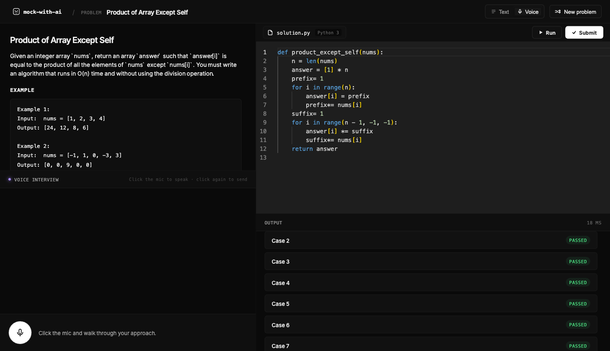
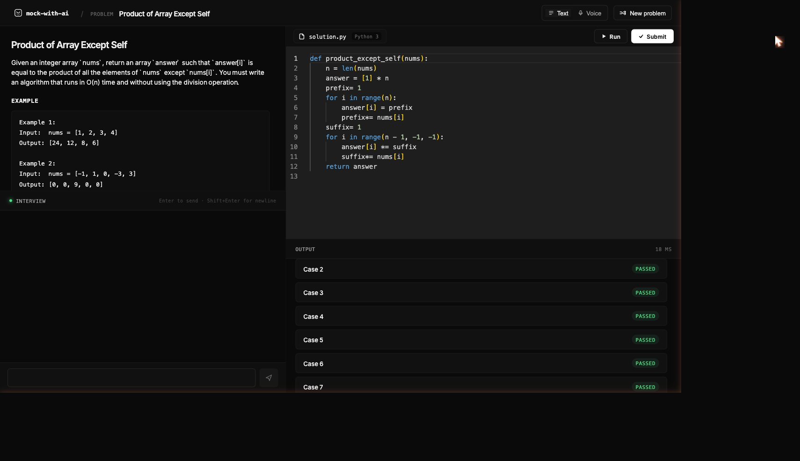
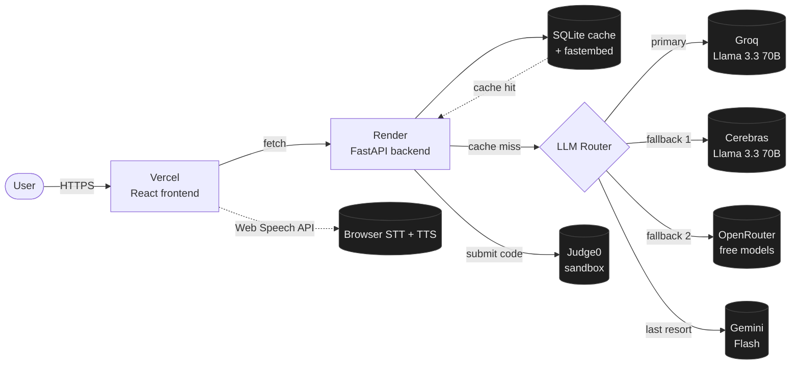

# mock-with-ai

A mock technical interview that talks back. Pick a problem, walk through your approach in text or voice, write code in a real editor, run it against hidden tests, and get a calibrated four-axis scorecard at the end. Built around a router of free-tier LLM providers so quota never gets in your way.

**Live demo:** <https://mock-tech-with-ai.vercel.app>

<!-- Drop hero screenshot into docs/screenshots/. See docs/screenshots/SCREENSHOTS.md -->


---

## Why this exists

LeetCode tests whether you can solve problems silently. Real interviews test whether you can solve problems while explaining your thinking, taking feedback, and backing up your decisions out loud. mock-with-ai is the second part — a no-stakes way to practice the conversation, not just the code.

The AI interviewer behaves like a mid-level engineer named Alex. It pushes back on shaky reasoning, asks for time/space complexity before letting you code, nudges you with questions instead of giving you the answer, and at the end produces a scorecard across four axes — correctness, code quality, communication, problem-solving — with concrete strengths and weaknesses.

## What makes it different

- **Voice mode.** Click a mic, talk through your approach like a real call. The AI hears you, thinks, and speaks back — fully browser-native, no API keys for the user.
- **Editor-aware AI.** The interviewer sees your code as you write it. It comments on what you've written (`"I see you started a loop over nums…"`) without reciting it back or naming the algorithm.
- **Real code execution.** Your code runs in a Judge0 sandbox against hidden test cases — actual `passed: 7/10`, not vibes.
- **Structured evaluation.** Submit triggers a scorecard, not a thumbs-up. Four numeric scores 1–5, a verdict (`strong / solid / needs work / not ready`), plus written strengths, weaknesses, and a summary.
- **Multi-provider LLM router.** Each turn walks Groq → Cerebras → OpenRouter → Gemini, hot-swapping on rate limit. All four free tiers stacked = effectively unlimited.
- **Semantic response cache.** Repeated questions ("Explain Two Sum", "Give me a hint", "What's the optimal approach?") hit a local SQLite + `fastembed` cache for an instant return — no LLM call needed.
- **Problem-agnostic prompt.** The system prompt knows nothing about specific problems. The current problem is injected as a context turn so the same interviewer persona works across the whole bank.

## Screenshots

| | |
|:--:|:--:|
|  |  |
| Landing page | Text interview mode |
|  |  |
| Voice interview mode | Scorecard after submit |

## Tech stack

| Layer | Choice | Why |
|---|---|---|
| Frontend | React 19 + TypeScript + Vite | Fast dev loop, strict types, modern toolchain |
| Type system | Strict TS | Schemas mirror the Pydantic backend models |
| Editor | Monaco | Same engine as VS Code, zero-config syntax highlighting |
| Display font | Fraunces (variable serif) | Editorial feel, soft Y, optical sizing |
| Backend | FastAPI (Python 3.11) | Pydantic schemas, async, OpenAPI for free |
| **LLM router** | Groq → Cerebras → OpenRouter → Gemini | 4 free tiers stacked; ~50K req/day combined |
| LLM model | Llama 3.3 70B (across providers) | 70B-tier quality with Gemini Flash as fallback |
| Cache | SQLite + `fastembed` (BGE-small-en) | Exact + semantic match, instant repeat responses |
| Code exec | Judge0 (RapidAPI) | Sandboxed multi-language execution, no infra to run |
| Voice STT | Web Speech API | Browser-native, free, ~1s latency |
| Voice TTS | `window.speechSynthesis` | Browser-native, free, OS-provided voices |
| Hosting | Vercel (frontend) + Render (backend) | Free tier, GitHub auto-deploy, keep-alive cron |
| Domain | is-a.dev (free) | `mock-with-ai.is-a.dev` |

## Architecture



The router walks providers in order, marking each one cooling-down for 60s on a 429 so we don't hammer a throttled provider. The cache scopes to `(problem_id, semantic_query)` — exact hash hit first, falling through to `fastembed` cosine similarity ≥ 0.92.

See [`docs/ARCHITECTURE.md`](docs/ARCHITECTURE.md) for the full breakdown.

## Quick start (local)

You need Python 3.11+, Node 20+, and at least one LLM provider key. Get all four free for maximum reliability.

```bash
git clone https://github.com/bekiTil/ai-mock-interview.git
cd ai-mock-interview

# Backend
cd backend
python -m venv .venv
source .venv/bin/activate
pip install -r requirements.txt
cp .env.example .env
# fill in at least GROQ_API_KEY (free, generous) and JUDGE0_API_KEY
uvicorn main:app --reload --port 8000

# Frontend (new terminal)
cd frontend
npm install
npm run dev
```

Open <http://localhost:5173>. Frontend defaults to `http://localhost:8000` for the API — no `.env.local` needed for local dev.

### Sign-up links for the LLM providers

- **Groq** (primary) — <https://console.groq.com> · Llama 3.3 70B, ~14K req/day, fastest
- **Cerebras** (fallback 1) — <https://cloud.cerebras.ai> · same model, even faster inference
- **OpenRouter** (fallback 2) — <https://openrouter.ai/keys> · free `:free` model tier
- **Gemini** (last resort) — <https://aistudio.google.com> · the original integration

You can run with just one of these. Setting all four gives you maximum quota headroom and zero downtime when any single provider hiccups.

### Confirm the router is healthy

```bash
curl https://your-backend-url/health/providers
```

Returns per-provider state, cool-down timers, and cache hit counts. Useful when debugging.

## Project structure

```
ai-mock-interview/
├── backend/
│   ├── main.py                       # FastAPI entrypoint
│   ├── app/
│   │   ├── config.py                 # env-driven settings
│   │   ├── routers/                  # /interview, /execution, /problems, /health
│   │   ├── services/
│   │   │   ├── interviewer.py        # uses router + cache
│   │   │   ├── evaluator.py          # uses router (JSON mode)
│   │   │   ├── llm_router.py         # multi-provider chain w/ circuit breakers
│   │   │   ├── llm_cache.py          # SQLite + fastembed semantic cache
│   │   │   ├── llm_providers/        # Groq, Cerebras, OpenRouter, Gemini
│   │   │   └── prompts.py            # interviewer + evaluator system prompts
│   │   └── schemas/                  # Pydantic request/response models
│   ├── data/llm_cache.db             # auto-created cache file
│   ├── problems/                     # JSON problem bank
│   ├── Dockerfile
│   └── requirements.txt
├── frontend/
│   ├── src/
│   │   ├── pages/                    # Landing, InterviewApp
│   │   ├── components/               # ChatPanel, VoicePanel, CodeEditor, OutputPanel, …
│   │   ├── hooks/                    # useSpeechRecognition, useSpeechSynthesis
│   │   ├── api/                      # typed fetch wrappers
│   │   ├── types/                    # shared types
│   │   └── styles/tokens.css         # design tokens (warm-dark + amber + cream)
│   ├── vercel.json
│   └── package.json
├── render.yaml                       # Render blueprint
├── .github/workflows/keepalive.yml   # 8-min cron, keeps Render warm 24/7
└── docs/
    ├── ARCHITECTURE.md
    ├── DEMO_SCRIPT.md
    └── screenshots/
```

## Deployment

- **Frontend** auto-deploys to Vercel on push to `main`. Set `VITE_API_BASE_URL` in Vercel's env vars.
- **Backend** auto-deploys to Render via `render.yaml`. Set all four LLM provider keys + `JUDGE0_API_KEY` in Render's Environment tab.
- **Domain**: `mock-with-ai.is-a.dev` via the [is-a.dev](https://www.is-a.dev) program, CNAMEd to Vercel.
- **Cold-start mitigation**: `.github/workflows/keepalive.yml` pings the backend every 8 min, 24/7, with retries — keeps Render's free tier warm.

## Design notes

The visual language is warm dark + amber + cream — deliberately not the generic "AI app" cyan/purple gradient stack. Display headlines are Fraunces (variable serif with optical sizing), body is Inter, UI labels and code are JetBrains Mono. There's a film-grain overlay across the whole app so surfaces don't read as AI-flat. See `frontend/src/styles/tokens.css` for the palette.

## Roadmap

**Done**
- [x] v1.0 — text chat interview with code execution + scorecard
- [x] v2.0 — voice mode (browser-native STT + TTS, free)
- [x] v2.1 — multi-provider LLM router with circuit breakers
- [x] v2.2 — semantic + exact response cache
- [x] Public deploy on Vercel + Render + is-a.dev
- [x] Editorial visual redesign (warm-dark + amber + Fraunces)
- [x] 24/7 keepalive cron with retries
- [x] Vercel Analytics

**Up next**
- [ ] 5–10 more problems beyond the seed set
- [ ] Difficulty + category filters in the problem picker
- [ ] Mobile QA pass
- [ ] Session history (persist past interviews + scorecards)

**Future**
- [ ] Neural TTS upgrade (OpenAI / ElevenLabs) for more natural voice
- [ ] Hands-free voice mode with VAD
- [ ] Behavioral interview mode
- [ ] Multi-language code support (JavaScript, Java)

## Built by

[Bereket Tilahun](https://github.com/bekiTil) — solo build.

If you have feedback or want to talk technical interviews / AI tooling, open an issue or DM.

## License

MIT
