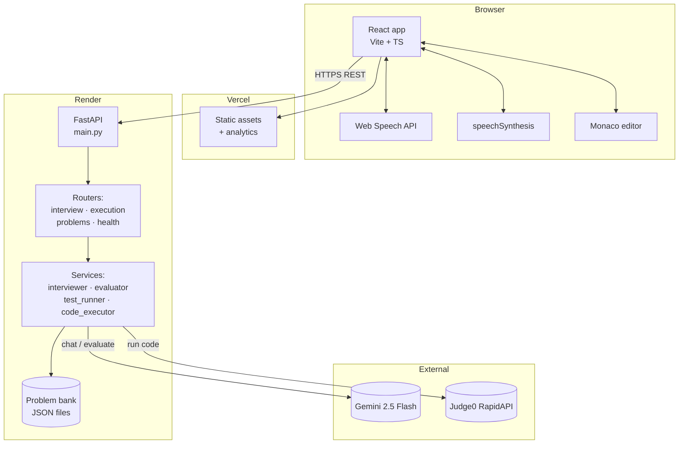
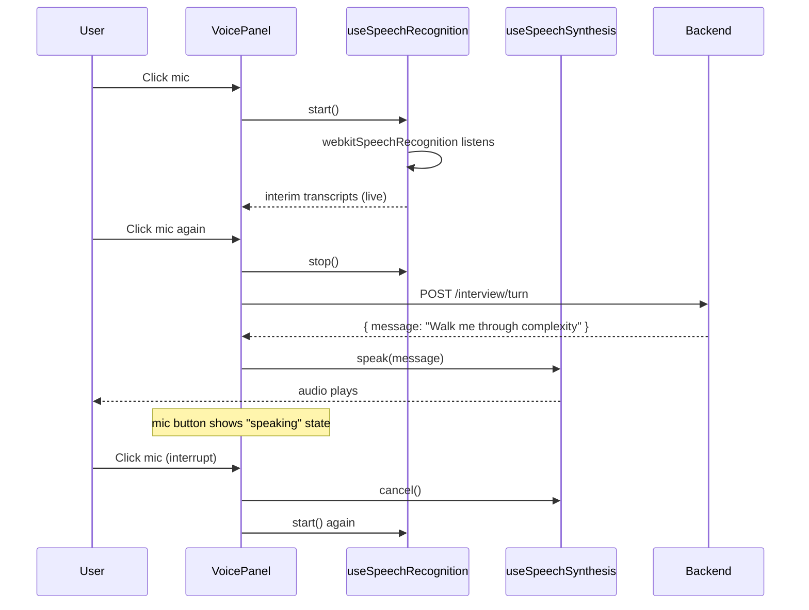

# Architecture

The deep-dive companion to the top-level README. Read this if you want to understand the design decisions, not just run the app.

## High-level shape



Everything talks HTTPS. No websockets in v2.0 (voice is push-to-talk, not streaming). No database — the problem bank is a static JSON folder bundled into the backend image, and interview state lives in browser memory until refresh.

## Why these choices

### Why FastAPI not Next.js API routes

Pydantic schemas earn their keep: every endpoint's request and response shape is declared once in Python and validated at runtime. The frontend imports matching TypeScript interfaces from `frontend/src/types/index.ts` — they're kept in lockstep by convention, not codegen. The OpenAPI doc Render serves at `/docs` is free debugging.

### Why Gemini not OpenAI

Gemini 2.5 Flash Lite has a free tier that scales beyond what a portfolio project needs. Latency is ~800ms-1.5s for short turns. The structured-output mode produces clean JSON for the scorecard without needing function calling.

The choice is swappable — the only Gemini-specific code is in `app/services/interviewer.py` and `app/services/evaluator.py`. Both wrap `google.genai.Client.models.generate_content`. Replacing with `openai.chat.completions.create` is a 30-line change per service.

### Why Judge0 not subprocess

Running untrusted user code on the same machine as the API is a security disaster. Judge0 runs each submission in an isolated container with CPU/memory limits and a 5-second wall-clock cap. RapidAPI's free tier gives you 50 executions/day — enough for an MVP, swappable to self-hosted Judge0 later.

### Why Web Speech API not Whisper

For v2.0 the goal was free + zero-latency. Web Speech is browser-native, no server roundtrip for STT (Chrome does ship audio to Google for transcription, but it's anonymous and free to the developer). The tradeoff is browser support — Firefox doesn't have it. The voice-mode toggle gracefully disables itself there.

Future v2.1 could switch to Whisper for offline support, but that's a 10× engineering cost for marginal benefit on a portfolio project.

### Why no auth

There's no per-user state to protect. Every interview is ephemeral, no profile, no history. Adding auth is an explicit future-work item once we add session history.

## The interviewer's prompt

The most interesting backend code is in `app/services/prompts.py`. Three design choices worth flagging:

1. **The prompt is voice-ready by default.** It says "Your entire response is spoken directly to the candidate, as if over a video call. Output plain conversational text, 1–3 sentences, nothing else." This means the same model output works for text and for TTS playback. No mode-specific prompt branches.

2. **The prompt is problem-agnostic.** It says nothing about Two Sum or hash maps. The current problem is injected as a synthetic user/model turn pair before the conversation history:

   ```
   [user]  "[PROBLEM — the problem the candidate is solving]
            Title: ...
            Description: ..."
   [model] "Understood. I have the problem in mind."
   [user]  "[EDITOR STATE — the code the candidate currently has]
            ```python
            ...
            ```"
   [model] "Understood, I can see the editor."
   [user]  <real conversation turn 1>
   [model] <real conversation turn 1>
   ...
   ```

   Gemini handles this smoothly because it's trained on alternating user/model. The model never recites the problem back because the prompt explicitly bans it, but it knows what problem you're on.

3. **Hard rules at the bottom.** Most prompt failures came from the model drifting into markdown headers, stage directions, or "Great question!" filler. The HARD RULES section is verbatim what the model is most likely to violate, listed in negative-example form. Repetition is doing real work there.

## The scorecard

`app/services/evaluator.py` is a second Gemini call after submit. It receives:

- Problem statement
- Full conversation history
- The candidate's final code
- Run-test results (which test cases passed/failed)

…and is asked to return a Pydantic-validated JSON shape:

```python
class Evaluation(BaseModel):
    verdict: Literal["strong", "solid", "needs_work", "not_ready"]
    correctness: int  # 1-5
    code_quality: int
    communication: int
    problem_solving: int
    strengths: list[str]
    weaknesses: list[str]
    summary: str
```

The prompt for the evaluator is loaded from `app/services/prompts.py`, separate from the interviewer prompt. It's narrower and gives concrete rubrics: e.g., "communication = 1 if the candidate submitted with zero dialogue."

## Voice mode internals



Key state-machine invariants:

- The mic button has three visual states: idle (white), listening (red, pulsing), speaking (blue, glowing). Each is exclusive.
- Clicking while speaking cancels TTS and starts listening — the "interrupt" feature.
- Switching to text mode mid-interview cancels any in-flight TTS to prevent it bleeding into the next mode.
- A `lastSpokenIndexRef` in `InterviewApp.tsx` tracks which interviewer message was last spoken, so toggling between modes doesn't replay backlog.

## What's intentionally missing

- **No streaming.** Each Gemini turn waits for the full response. Streaming would shave perceived latency by 300-500ms but adds complexity for ~no UX win at this size of model.
- **No retry logic.** A single network blip kills the turn. Retry-with-backoff is on the roadmap.
- **No conversation summarization.** History grows linearly; long interviews will hit the model context limit. Truncation/summarization is on the roadmap.
- **No tests.** The codebase has no automated tests. Highest-ROI testing target would be the evaluator JSON shape and the prompt-context injection in `interviewer.py`.

## Where to start reading

If you're a code reviewer or just curious, the highest-signal files in order:

1. `backend/app/services/prompts.py` — the most expensive lines per character in the codebase
2. `backend/app/services/interviewer.py` — how problem + editor context get injected
3. `backend/app/services/evaluator.py` — structured output, the scorecard
4. `frontend/src/pages/InterviewApp.tsx` — the orchestration layer
5. `frontend/src/hooks/useSpeechRecognition.ts` — Web Speech wrapping with TS typings the DOM lib doesn't ship
